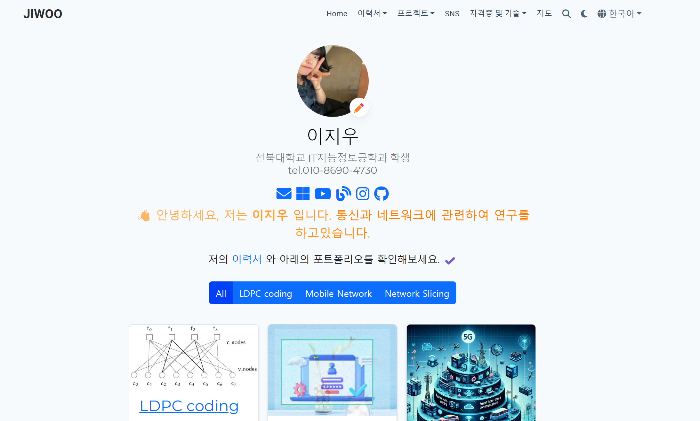

# [Jiwoo Portfolio](https://github.com/wldnek03/wldnek03.github.io)

**Jiwoo Portfolio**를 읽어보면 이지우(Lee Ji Woo)에 대해 더 잘 알 수 있습니다.

  

[10분 이내에 어떤 결과물을 얻을 수 있는지 최신 데모를 확인해 보세요](https://hugo-portfolio-theme.netlify.app/), 또는 [쇼케이스를 확인하세요](https://hugoblox.com/creators/).

통합된 [**Wowchemy**](https://hugoblox.com) 웹사이트 빌더와 CMS를 통해 무료로 아름다운 웹사이트를 쉽게 만들 수 있습니다. CMS(또는 선호하는 편집기)에서 사이트를 편집하고 [Hugo](https://github.com/gohugoio/hugo)로 생성한 후 GitHub 또는 Netlify로 배포하세요. 위젯, 라이트/다크 테마, 언어 팩을 사용하여 사이트의 모든 것을 사용자 정의할 수 있습니다.

- 👉 [**시작하기**](https://hugoblox.com/hugo-themes/)
- 📚 [**문서 보기**](https://docs.hugoblox.com/)
- 💬 [**Wowchemy 연구 커뮤니티와 대화하기**](https://discord.gg/z8wNYzb) 또는 [**Hugo 커뮤니티**](https://discourse.gohugo.io)
- ⬇️ [Hugo Academic CLI](https://github.com/GetRD/academic-file-converter)를 통해 BibTeX에서 인용을 자동으로 가져옵니다.
- 🐦 커뮤니티와 새로운 사이트를 공유하세요: [@wowchemy](https://twitter.com/wowchemy) [@GeorgeCushen](https://twitter.com/GeorgeCushen) [#MadeWithWowchemy](https://twitter.com/search?q=%23MadeWithWowchemy&src=typed_query)
- 🗳 [설문조사에 참여하여 #오픈소스를 개선하는 데 도움을 주세요](https://forms.gle/NioD9VhUg7PNmdCAA)
- 🚀 [개선 사항 기여하기](https://github.com/HugoBlox/hugo-blox-builder/blob/main/CONTRIBUTING.md) 또는 개선 사항 제안하기 [(버그 리포트)](https://github.com/HugoBlox/hugo-blox-builder/issues)
- ⬆️ [업데이트 중인가요?] 업데이트 가이드를 확인하세요 [(Update Guide)](https://docs.hugoblox.com/hugo-tutorials/update/) 및 [릴리스 노트](https://github.com/HugoBlox/hugo-blox-builder/releases)

## 우리는 여러분에게, 겸손하게, 이 오픈 소스 운동을 지원해 달라고 요청합니다.

오늘 우리는 Wowchemy 웹사이트 빌더와 테마의 오픈 소스 독립성을 방어해 주실 것을 요청합니다. 🐧

우리는 온라인에서 번성하기 위해 여러분의 지원에 의존하는 오픈 소스 운동이지만, 99.9%의 제작자들은 기부하지 않으며, 그저 외면합니다.

### [❤️ 클릭하여 GitHub 스폰서가 되어 보세요. 독점 학술 템플릿 및 위젯과 같은 멋진 혜택을 잠금 해제할 수 있습니다.](https://github.com/sponsors/gcushen)