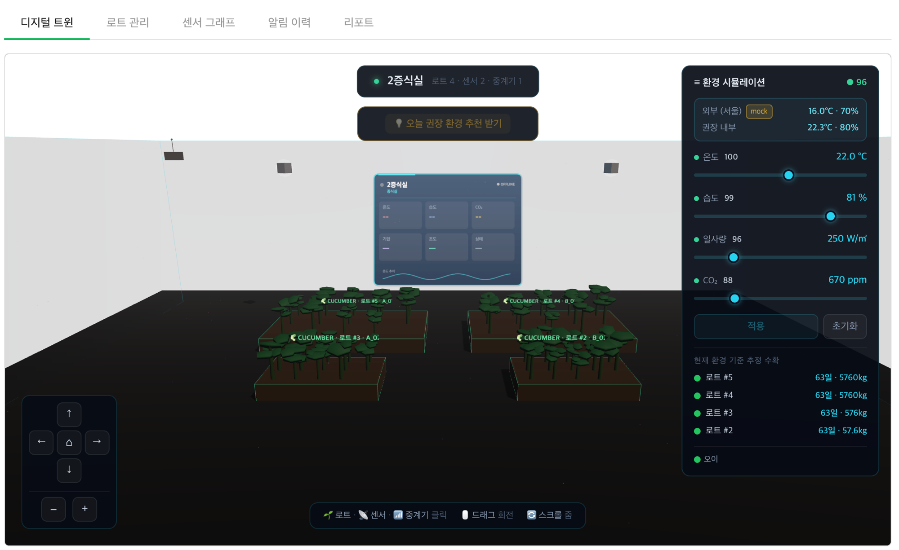

[🌱 GitHub Repository](https://github.com/capstone-SeedLabSystem/SeedLabDigitalTwin_System)

In charge of **backend development and server management** for a project that collects and monitors environmental data from a seed propagation lab in real time, visualizes the lab as a **3D digital twin**, and supports environment simulation and yield forecasting. Implementing a structure that reliably processes sensor data and delivers real-time information to users, continuously improving the system with attention to data flow and user usability. Through this project, strengthening operational problem-solving and collaborative communication skills.

**Key Work**

- Built a **digital twin** view that visualizes the propagation lab in 3D (lot · sensor · gateway interactions)
- Environment simulation across temperature · humidity · solar radiation · CO₂ with **recommended environment and yield-forecast** features
- Designed and implemented a backend structure that reliably processes sensor data
- Built a data pipeline that delivers real-time environmental information to users
- Provided operational features: lot management · sensor graphs · alarm history · reports
- Configured server operations, deployment, and monitoring environments
- Continuously improved the system with attention to data flow and user usability

**Tech Stack**

- Frontend: 3D digital twin visualization (Three.js / WebGL)
- Backend: Node.js / Express
- IoT: Sensor data collection and processing
- Server: Linux server operations
- Collaboration: Git / GitHub
<head>
    
</head>
