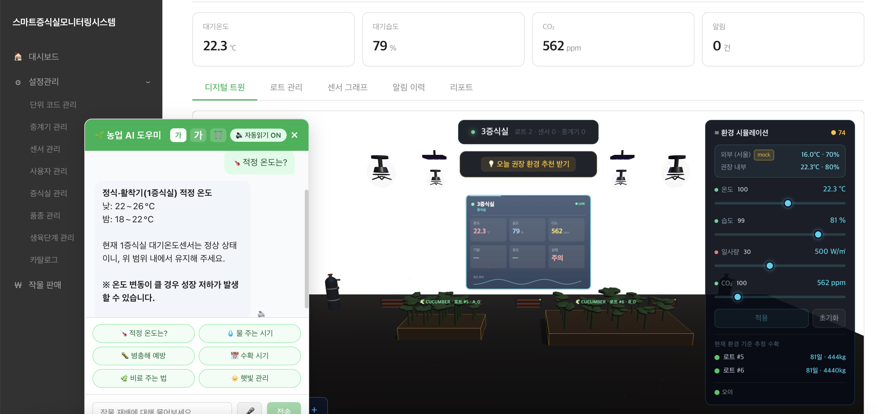

[🌱 GitHub Repository](https://github.com/capstone-SeedLabSystem/SeedLabDigitalTwin_System)

A seed propagation lab is a cultivation facility for systematically producing and managing seeds of superior varieties; since seed quality depends directly on the growing environment, real-time environmental management is essential. This project is a system that integrally manages the entire propagation lab operation — from sensor-based data collection to threshold alerts, 3D digital twin visualization, and environment simulation. I am in charge of **backend development and server operations**.

**Key Features**

- **Real-time environment monitoring** — Collects air temperature/humidity and soil moisture/temperature sensor data every 5 minutes and displays per-lab status on a dashboard
- **3D digital twin** — Visualizes the propagation lab in 3D with interactive lot/sensor/gateway exploration; region colors change when thresholds are exceeded
- **Threshold alerts** — Detects threshold violations, sensor anomalies, and communication loss, providing real-time web alerts
- **Environment simulation & yield forecasting** — Simulates environmental conditions (temperature, humidity, solar radiation, CO₂) to predict recommended environments and yield
- **LLM chatbot** — Answers natural-language questions about environmental data and suggests optimal growing conditions such as ideal temperature/humidity per crop (powered by the Groq API)
- **Lot & growth management** — Tracks growth stage, quantity, and status per variety lot, with change-history management
- **Sensor data graphs & reports** — Time-series queries by period, with hourly/daily aggregated graphs and reports

**My Role — Backend & Server Operations**

- Implemented domain REST APIs (propagation lab, lot, sensor, alert) and JWT authentication/authorization (Viewer/Admin roles) with Spring Boot
- Designed the data pipeline (sensor → MQTT/Mosquitto → RabbitMQ → storage/alert/real-time push) and prevented data loss through message-queue buffering
- Stored large volumes of sensor data with TimescaleDB and optimized period-based aggregate queries
- Configured a Docker-based deployment environment and handled server operations and monitoring

**Troubleshooting — Server Operations Stabilization**

In the early stage of collaboration, operational incidents recurred because deployments were carried out without an established procedure.

- **401 Unauthorized** — The DB password was changed during an API deployment, breaking the existing authentication-token connection
- **502 Bad Gateway** — Nginx was left stopped, so the reverse proxy could not respond
- **Server unresponsive** — The backend process was not restarted after deployment, so requests were not processed

I identified the root causes by tracing server logs and checking process status, and recovered the services directly. To prevent recurrence, I consolidated server access and deployment into a single channel, documented and shared a pre-deployment DB-connection verification procedure with the team, and automated repetitive checks with shell scripts — improving operational stability.

**Tech Stack**

- Backend: Java / Spring Boot, Spring Data JPA, Spring Security (JWT)
- Database: PostgreSQL / TimescaleDB
- Messaging · IoT: MQTT (Mosquitto), RabbitMQ
- Realtime: WebSocket (STOMP)
- Frontend: React, Three.js (3D digital twin)
- Infra: Docker / Docker Compose, Nginx
- Collaboration: Git / GitHub
<head>
    
</head>
